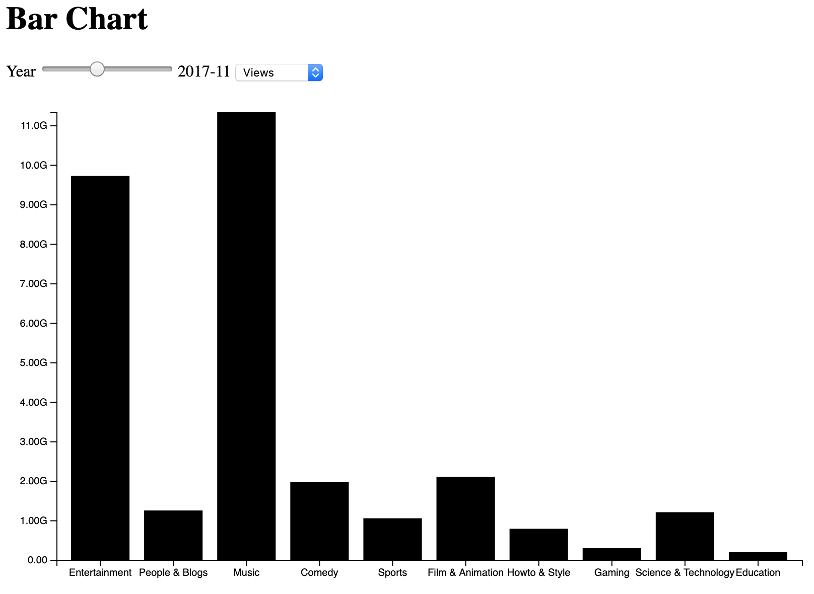
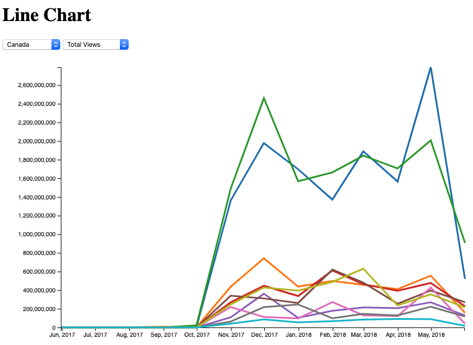
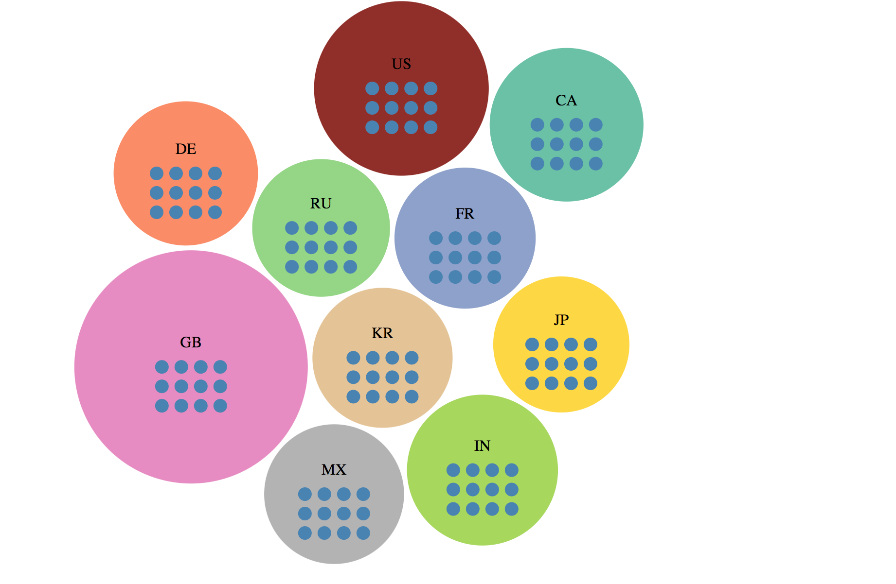
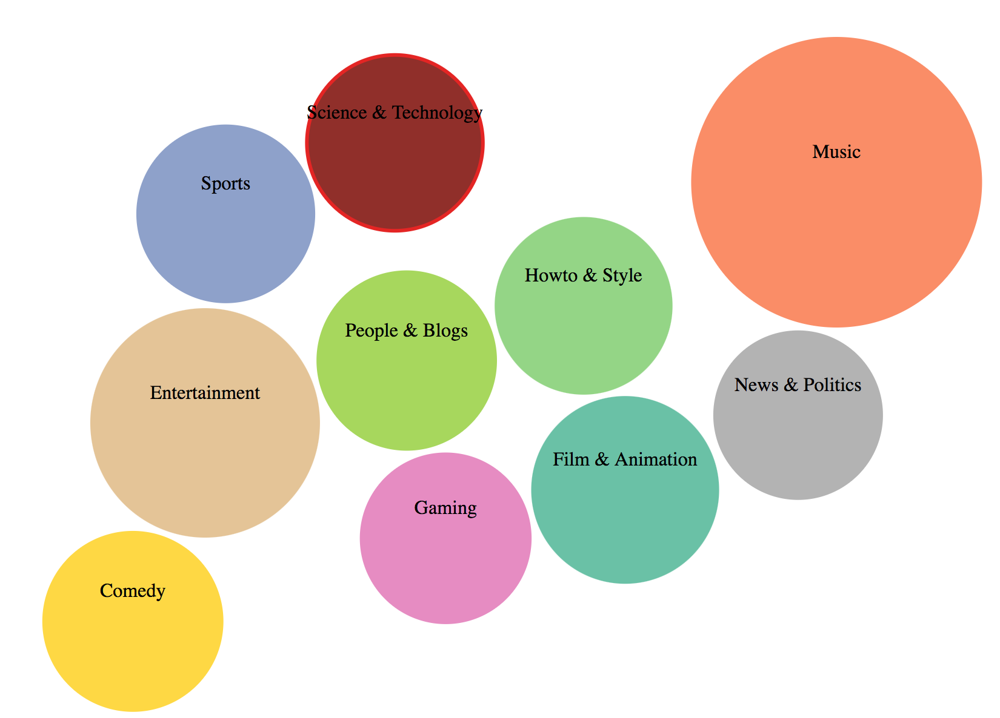

# Top 10 Trending Youtube Categories

## CPSC 436V Project

Team members: Michael Goh (e1m0b), Anita Tse (b7y0b), Leo Lin (l1k0b)

Data used: https://www.kaggle.com/datasnaek/youtube-new#CAvideos.csv

## To Start the server
```
yarn install
yarn serve
```

OR

```
python -m SimpleHTTPServer 8000
```

# Milestone 2

Data source: https://www.kaggle.com/datasnaek/youtube-new#CAvideos.csv

**NOTE**: As of the Milestone 2 deadline, each view is displayed separately on different pages (click the links to find them), with each view taking about 20 seconds to load before viewing. We are aware of this and are working towards improving this for the next milestone. 

### The milestone, and what's changed

Our vision to create visualizations to help Youtubers [explore] categories and [identify] trends has not changed since the first Milestone.

However, our visualization goals have changed since the first milestone:

For the barchart, we had initially agreed to switch this view into a grouped bar chart at the beginning of Milestone 2, with bars denoting total views, comments, and likes alongside each other. However, after plotting out the data, we found that the number of views were disproportionately larger than the other two quantifiers and would make them almost impossible to see. Because of this, we decided to revert back to a basic bar graph and have a dropdown menu to toggle between the different quantifiers.

For the line plot, we had originally planned to toggle between categories and see how trends change between countries over time, using a line to denote each country. However, we realized that based on the different population sizes of each country, the countries with higher populations will constantly appear to be "trending" because of the sheer population, which is a misinterpretation of the data. We decided that it would be more valuable to toggle between countries and see how _categories_ trend over time, (now using a line to denote each category).

For the innovative view, we had originally planned to create a heatmap in the same style as the git-commit graphs shown on your profile on Github web. Upon recommendation from our TA and professor, we decided to completely change this view because the information in this visualization is already expressed in our other 2 views and we would need to more complexity to it. We have decided to make our innovative view in the style of [this D3 visualization](https://wattenberger.com/blog/d3), allowing the user to [browse] between the different facets quickly and see a nested structure easier. For example, clicking on the dots (each representing a month) on the visualization (grouped by country) can expand to show the video information for that month.

We believe that the visualizations will allow users to view explore the youtube data from a number of facets at the same time (Over time, region, different quantifiable video metrics).

### Data Preprocessing

As mentioned in the first milestone, a sizable amount of data preprocessing was required to make it usable for our project. The Youtube data for each country was stored in a separate .csv file, where the video categories are an id with corresponding names linked in a separate .json file.

We also noticed that `tags` column in the .csv files posed issues with preprocessing, because the tags are expressed as such:

```
plush|"bad unboxing"|"unboxing"|"fan mail"|"idubbbztv"|"idubbbztv2"|"things"|"best"|"packages"|"plushies"|"chontent chop"
```

and the pipe `|` gets interpreted as a delimiter when using d3. Because of this and the fact that we will not be using the tags data anyway, we decided to manually remove this column using Excel.


We then used Javascript to:

1. Combine the data from all of the .csv files
2. Turn necessary fields into numbers (views, likes, comments)
3. Grab the category names from the .json files by id
4. Group all video data by category
5. Remove duplicate data

This is what was used for the base preprocessing. view-specific data preprocessing is then done separately on their own `<visualization>_preprocessing.js` files as needed.

### Bar Chart

The bar chart was an appropriate view to [compare] 1 attribute (a choice between views, likes, or comments) across a number of video categories. The cardinality of the view data is between 0 (if there were no videos for that month) and a finite large number (58,307,284,316 total views for Music in 2017-11). The mark [line] encodes the quantifier (either views, likes, comments) and the channel [length] encodes the quantity of it (quantitative). [Horizontal position] encodes the video category (categorical).

The date slider allows the viewer to quickly toggle between different months and see how the numbers differ between the  different categories. The dropdown lets you quickly toggle between different quantifiers. For additional data preprocessing, we needed to aggregate the total numbers of views, comments, and likes across all videos published in the same month, for every month.



### Line Plot

The line chart is an appropriate view to compare how trending categories on Youtube do over time based on our dataset. As part of the design for the line chart, users will be able to switch between different countries to see how these categories may depending on their target audience.

For each category, I have encoded color hue as to represent the different categories so that they are distinct from one another. The horizontal position represents the time period of the dataset and the vertical position is the total amount depending on the measurement selected from the dropdown: likes, comments and views. There is also a dropdown to switch between the different countries as mentioned above.

In terms of further implementation, there will be a legend to show which colors correspond to which category. In addition to this, linking with the innovative view by highlighting the Hovering over a category line will highlight a category circle in the innovative view and hovering over a point on the line will highlight the month circle in the innovative view as well.



### Innovative View

The innovative view employs a style similar to circle parking graph. Big circle represents countries while the smaller circles
within the country circles represent a month in a year. Upon click on the little circle, it will expand to 10 categories circles.
It is a fun and enjoyable view while the user is able to compare feature (# of likes # of comments or # of views)
across countries or when expanded across categories of that country in the specified month. The raw data used in this graphs
are countries (categorical, cardinality: 10), top 10 categories (categorical, cardinality: 10) and # of views, # of likes, # of comments (all quantitative, range: 0 to 58,307,284,316).
We derive the # of views, # of likes, # of comments of a category or a country by summing up the values from individual videos.

For visual encoding, the mark point is used. Channel Area 2D is used to encode the selected indicator (# of views, # of likes # of comments).
Colour hue is used to encode the categorical attributes, country name or when expanded cateogry name.

In the finished product, there will be linked interaction between the view and the line plot. When a country circle is selected on this graph
it will change the selected country on the line plot. Hovering over a month circle will highlight the corresponding point on the line plot if available.
Hovering over the category ball upon expanding will highlight the corresponding line on the line plot.




## Project Management & Team Assessment

### Status Update

Due to the feedback we received from Milestone 1, we had to pause on working on our project until we hashed out a new innovative view, consulted with our TA/prof, and waited for approval hence the progress appears to be late/behind schedule from our initial internal milestones. We also did not take into account the depth of the Milestone 2 Writeup and did not include those hours in the original schedule:  

#### Time estimates

##### Pre-visualization

  - Project proposal (5 hours) -> (5 hours)
  - data pre-processing (5 hours) -> (8 hours)
  - Hash out how the dashboard will be displayed (1 hour) -> (1 hour)
  - Establish 10 categories to view (1 hour) -> (1 hour)
  - Explore git-commit graph view feasibility and try basic implementation (8 hours) -> (8 hours)
      - These 8 hours went towards reviewing Milestone 1 feedback, meeting with prof during office hours, additional meetings to brainstorm alternative innovative view from git-commit graph


##### Bar chart
  - Additional data preprocessing (not allocated) -> (4 hours)
  - Implementing bar chart static view (6 hours) -> (5 hours)
    - Implemented group bar chart before reverting back to original one (+ 3 hours)
  - Implementing year slider (4 hours) -> (3 hours)
  - Implementing dropdown selection (4 hours) -> (3 hours)

##### Line plot

  - Additional data preprocessing (not allocated) -> (4 hours)
  - Implementing static view (12 hours) ->  (6 hours)
  - Implementing year slider (8 hours) ->  was not needed since we re-designed some of the views after our initial proposal
  - Implementing dropdown selection (8 hours) ->  (10 hours)
  - Implement link between line plot and innovative view (6 hours)

##### Innovative view

  - Additional data preprocessing (4 hours)
  - Implementing static view (12 hours)
  - Implementing animation and d3 force (4 hours)
  - Implementing expanded static view (4 hours)

#### Milestone Writeup

- (originally not allocated) -> (4 hours)

### Date estimates

  - Proposal (March 6th -> March 6th)
  - Rest of pre-visualization + processing (see above section) (March 11th -> March 20th)
  - Static views for bar graph + line plot (March 18th -> March 22nd)
  - Slider + dropdown functionalities (March 25th -> March 27th)
  - Innovative view (March 25th -> March 27th)

### Contributions Breakdown

As stated in our first milestone, each person started off working on one view, and once the simpler views were finished, that person can take on additional tasks and help with the more complex view. Based on this workflow, we are able to distribute the work equally.

Anita worked on the bar graph and milestone writeup, Michael worked on the line plot, and Leo worked on the innovative view and base data preprocessing.

### Team Process

|  | Performance |
| --- | --- |
| Team has a clear vision of the problem(s) | Excellent |
| Team is properly organized to complete task and cooperates well | Good |
| Team managed time wisely | Good |
| Team acquired needed knowledge base | Good |
| Efforts communicated well within group | Excellent |
