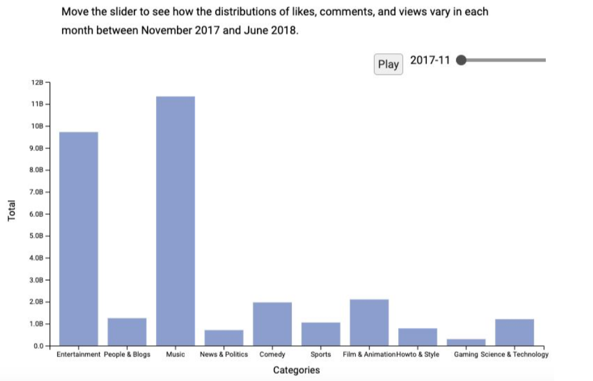

# Trending Youtube Categories Data visualization

Team members: Michael Goh, Anita Tse, Leo Lin

This visualization built as part of a project for my Data visualization class. 

## To Start the server
```
yarn install
yarn serve
```

OR

```
python -m SimpleHTTPServer 8000
```

## Overview

For a content creator looking to start a Youtube channel, they may be interested in researching the content already existing on Youtube to give them ideas on what kind of videos they should create to become popular. The popularity of videos on social media cannot simply be defined by the number of views. There are many other aspects that may determine the popularity of Youtube videos, including the number of likes, comments, and locations where said views are coming from. To address this challenge, we created a visualization that can allow a viewer to easily toggle through the different factors and see how they change between the top 10 video categories from a dataset. For our project, we show numerical comparisons of the 10 categories over time, while also showing how the numbers change according to the countries where the views come from. There is a bar chart to view the overall totals for the categories for a given year, while an interactive line and bubble chart lets you explore more facets of the video data including country and change over time.




## Data

Data source: ​https://www.kaggle.com/datasnaek/youtube-new#CAvideos.csv

We used the Trending Youtube Video Statistics dataset from Kaggle. Each video has 16 associated attributes that identify the video (video_id, title, channel_title, thumbnail_link, description), relevant dates (trending_date, publish_date), category information (category_id, tags), information to quantify popularity (views, likes, dislikes, comment_count), and other information that may affect the quantifiability of the video (comments_disabled, ratings_disabled, video_error_or_removed). All of these attributes in the dataset are categorical in nature, with the exception of the quantitative attributes (views, likes, dislikes, comment_count) and dates (trending_date, publish_date). The videos are divided into different tables according to countries. Each country also has their own separate category table that shows the name of the category given the category_id, as the video table only contains the category id.
Data preprocessing

A sizable amount of data preprocessing was required to make it usable for our project. The Youtube data for each country was stored in a separate .csv file, the video categories in these files are represented with a category id with corresponding names located in a separate .json file.

We also noticed that `tags` column in the .csv files posed issues with preprocessing, because the tags are expressed as such:

```
 plush|"bad unboxing"|"unboxing"|"fan
 mail"|"idubbbztv"|"idubbbztv2"|"things"|"best"|"packages"|"plushies"|"chontent chop"
 ```
 
and the pipe `|` gets interpreted as a delimiter when using d3. Because of this and the fact that we will not be using the tags data anyway, we decided to manually remove this column using Excel.
 
We then used Javascript to:
1. Combine the data from all of the .csv files
2. Turn necessary fields into numbers (views, likes, comments)
3. Grab the category names from the .json files by id
4. Group all video data by category
5. Remove duplicate data

This is what was used for the base preprocessing. view-specific data preprocessing is then done separately on their own `<visualization>_preprocessing.js` files as needed.
In our first submission, we found that it would take over 20 seconds to load all of the data. To resolve this, we wrote another script `truncate_data.js` to remove data we would no longer need (eg. video data outside of the 10 categories) for the visualization and save it to new files in `/data/truncated/`. Our visualization would then use the data from `/data/truncated/` instead of processing 539MB of data each time we load the page.

## Goals & Tasks 

In the perspective of the user, Bob is a content creator who is looking to start a Youtube channel and hopefully become famous for it. He wants to [explore] the dataset to [identify] the most popular categories over time and regions of the world. He can also [compare] how the views, comments, and likes differ, and determine whether there is a correlation between the 3 variables. Bob may discover that the number of views is not always an indicator of a successful video, and he may need to find more engagement in terms of likes and comments. He may also see the trends in categories and see which upcoming categories may be a good idea to make videos for. With this visualization, he can decide which category he might be interested in making videos for, and see which attributes he should use to quantify success in his videos.

In abstract language, we are using our visualization to explore and identify trends, and compare similarities between different quantifiers.

## Visualization

Our visualization consists of 3 different views: There is a bar chart to view the overall totals for the categories for a given year, while a line and bubble chart lets you explore more facets of the video data including country and change over time.

The date slider beside the bar chart allows the viewer to quickly toggle between different months and see how the numbers differ between the different categories. The dropdown lets you quickly toggle between different quantifiers. As part of the line chart, the users can use a dropdown to switch between different countries to see how trends in these categories vary depending on their target audience.

There is a dropdown inside a sticky header at the top of the page, which allows the viewer to toggle between the three quantifiers (likes, comments, views) across all 3 views. If you click on a country in the bubble chart, the line chart will update to the same country that was selected. Hovering over a month circle in the innovative view will
trigger the corresponding dots in the line plot to be highlighted. The same behaviour occurs when hovering over a category circle in the next level.

Hovering over the bubbles and dots plotted on the line chart will show a tooltip with the total views, comments, or likes for the given point. Unfortunately, these tooltips may take a second or two to appear.


